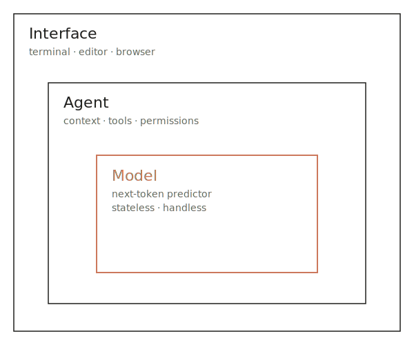
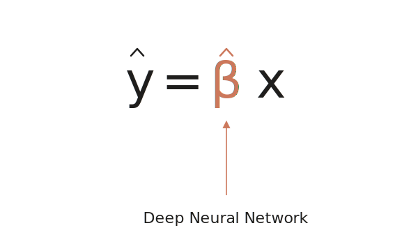
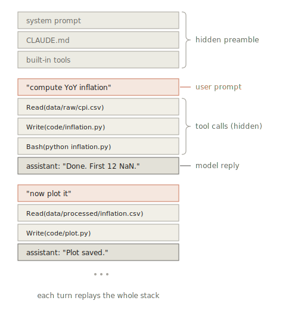

<!-- _class: title -->
<!-- _paginate: false -->

# AI Tools for Economics Research

Session 1 — Foundations
Monday 25 May 2026
10:30–12:00 · 14:30–16:00
Banco de Portugal
João B. Sousa · Nova SBE

---

<!-- _class: center -->

<h4>About this course</h4>

## Working with AI agents on research tasks.

Four sessions, three hours each. Live demos. Bring your laptop.

---

<!-- _class: takeaways -->

<h4>The four sessions</h4>

## What we'll cover, and when.

<ul>
<li><strong>Mon 25 May</strong> &nbsp; Foundations — agents and plumbing.</li>
<li><strong>Fri 29 May</strong> &nbsp; Worked examples — research tasks, live.</li>
<li><strong>Mon 22 June</strong> &nbsp; Failure modes and verification.</li>
<li><strong>Tue 23 June</strong> &nbsp; Customising — skills, hooks, subagents, MCP.</li>
</ul>

Each session: 10:30–12:00 and 14:30–16:00.

---

<!-- _class: center -->

<h4>Today</h4>

## Before any of that — what is an AI agent?

Not a smarter autocomplete. A program that lets a language model read your files, run commands, and edit code — under your permission.

---

<!-- _class: divider -->
<!-- _paginate: false -->

01

## The landscape.

---

<h4>Many products, similar marketing</h4>

## The names we keep hearing.

<ul>
<li>Claude Code</li>
<li>Codex</li>
<li>Gemini</li>
<li>Copilot</li>
<li>Cursor</li>
</ul>

---

<!-- _class: split -->

<h4>Three layers</h4>
<h2>Model. Agent. Interface.</h2>

<ul>
<li><strong>Model</strong> &nbsp; the LLM. No memory between turns, no access to your files.</li>
<li><strong>Agent</strong> &nbsp; holds context, calls tools, asks permission.</li>
<li><strong>Interface</strong> &nbsp; where you type. Browser, editor, terminal.</li>
</ul>

Same model + different agent = different product.

---

<!-- _class: split -->

<h4>The piece in the middle</h4>
<h2>What is an LLM?</h2>

A probability model over text. You hand it some text; it returns the most likely continuation, one piece at a time.

Same shape as a fitted regression — except the estimator is a deep neural network with billions of parameters.

The agent layer is what makes this useful — next slide.

---

<h4>If it's stateless...</h4>

## ...how does it remember anything?

It doesn't. Each turn, the <strong>harness</strong> — the program wrapping the model — hands it a fresh text bundle: instructions, tools, <code>CLAUDE.md</code>, every prior message and tool result, plus your new input. That bundle is the <strong>context</strong>.

The harness also owns the tool calls, the file permissions, and the project instructions.

Bounded by a context window (200K–1M tokens). Re-sent every turn — drives both cost and rate limits.

---

<h4>What it looks like</h4>

## A real session.

<pre><code>$ claude

&gt; write the .py code to compute year-over-year
  inflation, save as data/processed/inflation.csv
  plot it to a png file. the data format is:

⏺ Read(data/raw/cpi.csv) — 952 lines
⏺ Write(code/scripts/compute_inflation.py) — 23 lines
⏺ Bash(python code/scripts/compute_inflation.py)
  ⎿ Wrote data/processed/inflation.csv (953 rows)

Done. </code></pre>

What a chat box cannot do: open the file, run the code, report back.

---

<h4>Mapping the tools</h4>

## Where each one runs, what it can touch.

<table>
<thead>
<tr><th>Tool</th><th>Runs in</th><th>Can touch</th></tr>
</thead>
<tbody>
<tr><td>Claude / Claude Code</td><td>App / Terminal</td><td>Uploaded files / Whole filesystem</td></tr>
<tr><td>Codex / Codex CLI</td><td>App / Terminal</td><td>Uploaded files / Whole filesystem</td></tr>
<tr><td>Gemini / Gemini CLI</td><td>App / Terminal</td><td>Uploaded files / Whole filesystem</td></tr>
<tr><td>Copilot</td><td>Editor</td><td>Open files, workspace</td></tr>
<tr><td>Cursor</td><td>Editor</td><td>Workspace</td></tr>
</tbody>
</table>

Pick by where you work, not by which model is "best" this month — most can swap models.

---

<h4>Privacy and data handling</h4>

## What leaves your machine.

<ul>
<li><strong>The model runs on someone else's servers</strong> — Anthropic, OpenAI, Google. No comparable local option.</li>
<li><strong>What the agent reads ships upstream</strong> — files, command output, truncated excerpts.</li>
<li><strong>Editor extensions send more than your prompt</strong> — Copilot, Cursor ship neighboring files and recent edits as context.</li>
</ul>

---

<!-- _class: center -->

<h4>The lever</h4>

## The agent layer is configurable.

Without retraining the model: <code>CLAUDE.md</code>, hooks, skills, MCP servers, permissions.

Sessions 2–4 are about pulling these levers for research workflows.

---

<!-- _class: center -->

<h4>Pause</h4>

## Questions so far?

---

<!-- _class: divider -->
<!-- _paginate: false -->

02

## Chat vs. command-line (CLI) agent.

---

<!-- _class: center -->

<h4>How most people meet AI</h4>

## A box in a browser.

You paste text or upload files. You get text back. You copy the parts you want into a note.

This is fine for many things. It is not what the rest of this course is about.

---

<!-- _class: center -->

<h4>Live demo</h4>

## Chat vs. Claude Code, same prompt.

<pre><code>Compute year-over-year inflation from data/raw/cpi.csv.
Save the clean series to data/processed/inflation.csv
and a plot to slides/assets/inflation.png.</code></pre>

---

<!-- _class: split -->

<pre><code>Compute year-over-year inflation from data/raw/cpi.csv.
Save the clean series to data/processed/inflation.csv
and a plot to slides/assets/inflation.png.</code></pre>

<h4>Chat</h4>

<ul>
<li>Open CSV, paste header.</li>
<li>Get code, save, run.</li>
<li><code>ParserError</code>. Paste back. Rerun.</li>
<li><strong>You are the loop.</strong></li>
</ul>

<h4>CLI agent</h4>

<ul>
<li>One prompt with file paths.</li>
<li>Reads, writes, runs.</li>
<li>Same <code>ParserError</code>. Self-fixes.</li>
<li><strong>You review the loop.</strong></li>
</ul>

---

<h4>What changed</h4>

## The model can act on the world.

<ul>
<li><strong>Read</strong> &nbsp; files from disk — no copy-paste, no upload limits.</li>
<li><strong>Run</strong> &nbsp; commands — <code>ls</code>, <code>grep</code>, <code>pytest</code>, <code>make</code>.</li>
<li><strong>Edit</strong> &nbsp; code — changes appear as diffs you review.</li>
</ul>

Three consequences: cost, control, reproducibility.

---

<h4>Consequence 1</h4>

## Cost.

Browser chat: each message ships the whole context again.

CLI agent in your repo: large stable parts of the input — instructions, files, prior turns — are cached at a fraction of the input cost on subsequent turns.

Detail in Session 3. For now: you don't hit your usage cap as fast.

---

<h4>Consequence 2</h4>

## Control.

<ul>
<li>You see every file the agent reads.</li>
<li>You see every command before it runs (default permission mode).</li>
<li>Every edit is a diff. <code>git revert</code> undoes any of it.</li>
</ul>

---

<h4>Consequence 3</h4>

## Reproducibility.

Edits land in <code>git</code>. Commands land in shell history. The full session log can be saved to a file (Session 4 — hooks).

Anyone with the repo can re-run, audit, or take over.

---

<!-- _class: split -->

<h4>Back to the bundle</h4>
<h2>The context window is a budget.</h2>

Each turn, the harness ships the full conversation back to the model — your prompts, the model's replies, <em>and every tool result</em>. The 952-line CSV read earlier stays in the bundle on every subsequent turn.

Bounded at 200K tokens (1M with extended context). Quality degrades well before the limit.

---

<!-- _class: takeaways -->

<h4>End of morning</h4>

## Where we are.

<ol>
<li>Agent = harness around a stateless LLM. Same model + different harness = different product.</li>
<li>Chat → CLI means the model can <strong>read, run, edit</strong> — and you review the diff.</li>
<li>Three consequences: <strong>cost</strong> (caching), <strong>control</strong> (diffs and permissions), <strong>reproducibility</strong> (git and logs).</li>
<li>Context is finite — every turn replays the whole bundle.</li>
</ol>

---

<!-- _class: center -->
<!-- _paginate: false -->

<h4>Break</h4>

14:30

Back after lunch.

---

<!-- _class: divider -->
<!-- _paginate: false -->

03 · AFTERNOON

## The infrastructure underneath.

---

<!-- _class: center -->

<h4>Where the rest of the course lives</h4>

## The agent is useless without filesystem, shell, git, an editor, and permissions.

Five minutes on each. Minimum viable mental model. We'll open a terminal and look at each in turn.

---

<h4>Filesystem</h4>

## Everything is a file in a folder.

This course repo, for example:

<pre><code>bank_of_portugal_ai_2026/
├── README.md, CLAUDE.md
├── slides/             session{1..4}.{md,pdf}, assets/
├── code/
├── data/raw/           cpi.csv  ← from FRED
├── data/processed/
└── docs/               syllabus.pdf</code></pre>

The agent reads and writes files. That is the substrate. Nothing else.

---

<h4>Shell</h4>

## A program that runs commands.

<ul>
<li><code>ls</code> &nbsp; what's here</li>
<li><code>cd</code> &nbsp; go there</li>
<li><code>cat</code> &nbsp; read this file</li>
<li><code>grep</code> &nbsp; find this string</li>
<li><code>python clean.py</code> &nbsp; run this script</li>
</ul>

The agent's most-used tool. Whatever you can type, it can type.

---

<h4>git</h4>

## Snapshots of your project over time.

<ul>
<li><code>git status</code> &nbsp; what's changed since the last snapshot</li>
<li><code>git diff</code> &nbsp; show me the changes, line by line</li>
<li><code>git log</code> &nbsp; what snapshots exist</li>
<li><code>git revert</code> &nbsp; undo a snapshot</li>
</ul>

Without git, you cannot safely let an agent edit your files.

---

<h4>Editor</h4>

## Where you read the diff before approving.

VS Code is fine. Vim, Emacs, anything you already use is fine. The agent runs in the terminal next to it.

The editor is for you, not the agent.

---

<h4>Permissions</h4>

## Trust nothing by default.

<ul>
<li>Default mode: agent asks before every command and every edit.</li>
<li>You pre-approve safe patterns — <code>git status</code>, <code>git diff</code>, file reads inside the repo.</li>
<li>Anything destructive — file writes, <code>rm</code>, <code>git push</code> — still asks.</li>
<li><strong>You</strong> pick the working directory. Don't <code>cd</code> into folders with supervisory data, credentials, or PII.</li>
</ul>

---

<!-- _class: divider -->
<!-- _paginate: false -->

04

## Setup.

---

<h4>What you need</h4>

## Four things on your laptop.

<ul>
<li><strong>Claude Code</strong> &nbsp; installed and authenticated. (Or Gemini CLI, or Codex CLI.)</li>
<li><strong>git</strong> &nbsp; installed, with a test repo to play in</li>
<li><strong>GitHub account</strong> &nbsp; for cloning and hosting repos</li>
<li><strong>Optional</strong> &nbsp; Copilot in VS Code</li>
</ul>

---

<h4>Install</h4>

## Get Claude Code running.

<pre><code># macOS / Linux / Windows Subsystem for Linux (WSL)
curl -fsSL https://claude.ai/install.sh | bash

# Windows (PowerShell)
irm https://claude.ai/install.ps1 | iex

claude --version
claude   # first run opens browser for sign-in</code></pre>

Paid Anthropic plan required — Pro, Max, Team, or Enterprise. Free plan does not include Claude Code.

docs.anthropic.com/claude-code

---

<h4>Smoke test</h4>

## Does it work?

<pre><code>cd ~/bank_of_portugal_ai_2026
claude
&gt; What's in this repo?</code></pre>

The agent should describe the <code>slides</code>, <code>code</code>, <code>data</code>, and <code>docs</code> folders — actually read, not guess. If it does, you are running.

---

<!-- _class: takeaways -->

## Three ideas to carry into Session 2.

<ol>
<li>An agent is a <strong>harness around an LLM</strong>. The model is stateless; the harness is what you configure.</li>
<li>The shift from chat to CLI is the model being able to <strong>read, run, and edit</strong> — with diffs and git as safety net.</li>
<li>The agent is only as good as the <strong>filesystem, shell, and git</strong> underneath it. On Friday we use all three on real research tasks.</li>
</ol>

---

<!-- _class: title center -->
<!-- _paginate: false -->

# See you on Friday.

joao.sousa&#64;novasbe.pt

